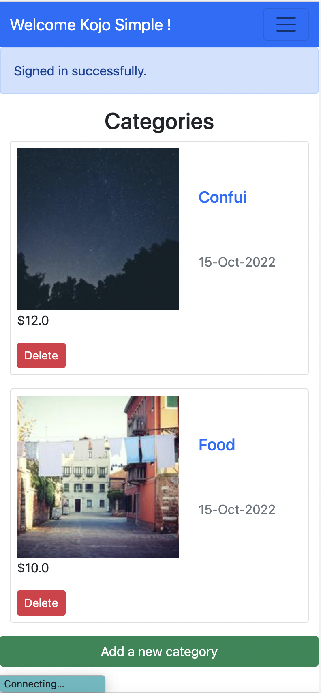
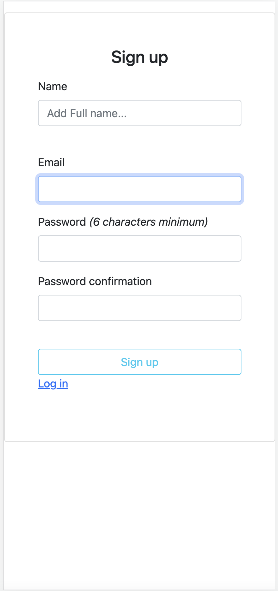

# Budget App

> Budget app is an app that helps you enter your planned expenses in categories

# The App Deployment
_[Here](https://www.loom.com/share/2493da8e15e14088827bc8d9ca24d71c)  The presentation video link_
_[Live Link](https://e-budget-plan.herokuapp.com/) The Live Application on Netlify

Splash Screen
        



# Getting Started


_To get a local copy up and running follow these simple steps._

1. Clone the repo
   ```sh
   git clone https://github.com/sabetech/rails_budget_app.git
   ```
2. Goto project directory
   ```sh
   cd rails_budget_app
   ```

3. Configure ` change  the Env credentials with your username and password
4. Run app
   ```sh
   rails server
   ```
   or
   ```sh
   rails s
   ```


# Testing

`bundle exec rspec` will run all the tests.

Also, you can run `bundle exec rspec spec/` to run specific tests.

You can also run `RAILS_ENV=test rspec spec/` to run the tests in test mode.

## Errors

If you encounter any errors, run the following commands.

- Run `rails db:drop db:create db:migrate` to drop, create and migrate a new database.

- Run `rubocop && rubocop -A` to check for and fix code errors.

# This project was built with

- Ruby on Rails

- PostgreSQL

- Bootstrap CSS Framework

# Author 

👤 **Albert Mensah-Ansah**
- GitHub: [@sabetech](https://github.com/sabetech)
- Twitter: [@al_kfx](https://twitter.com/al_kfx)
- LinkedIn: [@albert-mensah-ansah](https://www.linkedin.com/in/albert-mensah-ansah/)


# 🤝 Contributing

Contributions, issues, and feature requests are welcome!

Feel free to check the [issues page](https://github.com/sabetech/rails_budget_app/issues).

# Show your support

Give a ⭐️ if you like this project!

# Acknowledgement

- Hat tip to anyone whose code was a source of inspiration.
- A big thanks to [@microverseinc](https://github.com/microverseinc).
- Thanks to [@gregoirvella](https://www.behance.net/gregoirevella) for the UI inspiration.

# 📝 License

This project is [MIT](./MIT.md) licensed.